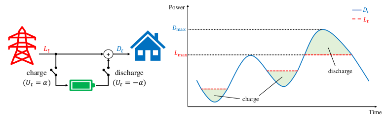

# Lecture 01: Introduction

## Illustrative Example: Peak Shaving
Consider a dynamic model where we have a battery that we can charge and discharge. The goal is to deploy the electricity of this battery in order to meet peak demand in a power grid.

We will model the consumer electricity cost using 
$$
g_{e} = \sum_{t=1}^{24} L_{t} \phi(t) + (\max_{1 \leq t \leq 24} L_{t})\phi_{\text{peak}}
$$
With the battery included, we get the dynamic model
$$
\begin{cases}
C_{t+1} = \min (\max(C_{t}+U_{t}, 0), C)\\
L_{t+1} = (C_{t+1} - C_{t}) + D_{t+1}
\end{cases}
$$
With $U_{t} \in \mathbb{U} = \{\alpha, -\alpha, 0\}$ (charging, discharging, idle). The cost function for the battery usage is given as $g_{b} = \sum_{t=0}^{23} |U_{t}|$. Our goal then becomes to solve the following minimisation problem
$$
\min_{U_{0:T-1}} g_{e} + g_{b}
$$
Because we cannot know for certain the future outcomes, (these are stochastic), we will have to used a closed loop control law of the form 
$$
\mu: T \times \mathbb{X} \to \mathbb{U}
$$

{width=40%}

\fbox{\parbox{\columnwidth}{
\textbf{Note \textnormal{(Closed-Loop Control and Stochastic Systems)}.}
For deterministic systems, there exists a nice result showing that for each closed-loop control law, there exists an equivalent input sequence $\{u_{t}\}_{t=t_{0}}^{T}$ such that the behaviour of the open-loop system subject to this control sequence and the closed-loop system is equivalent. This is actually not the case for stochastic systems. Given some (Markov) control law, it can be proven that there does not exist a sequence of inputs such that the behaviour of the open-loop system will be identical.
}}

## Preliminaries
### Probability
The following notation will be used:

- $X \in \Omega_{X}\subseteq \R$
- $P(A)\; A\subseteq \Omega_{X}$, probability of event $A$
- $p(x, y) = P(X=x, Y=y)$ $\forall (x, y) \in \Omega_{X} \times \Omega_{y}$

\fbox{\parbox{\columnwidth}{
\textbf{Theorem \textnormal{(Law of Total Probability)}.}\textit{
Consider discrete random variables $X: \Omega_{X}\to \R$, $Y: \Omega_{Y}\to\R$. The law of total probability states that 
$$
p_{X}(x) = \sum_{y\in \Omega_{Y}} p_{X|Y}(x|y) p_{Y}(y) \quad \forall x\in \Omega_{X}
$$
So $P(X=x)$ given that we know $P(X=x|Y=y)$ is the sum over all possible conditional outcomes of $X$ given $Y$ weighted by the probability of this outcome of $Y$.
}}}

\fbox{\parbox{\columnwidth}{
\textbf{Theorem \textnormal{(Bayes Rule)}.}\textit{
A classic result is Bayes rule on conditional probability:
$$
p_{X|Y}(x|y) = \frac{p_{Y|X}(x|y)p_{X}(x)}{p_{Y}(y)}
$$
}}}

The expected value of $X$ is the expected (average) outcome of $X$:
$$
\mathbb{E}\left[X\right] = \sum_{x\in \Omega_{X}} xp_{X}(x)
$$
The expected value is a linear operator (proof shown below)
$$
\mathbb{E}\left[X+Y\right] = \mathbb{E}\left[X\right] + \mathbb{E}\left[Y\right]
$$
and by the law of total expectation we have 
$$
\mathbb{E}\left[X\right] = \mathbb{E}\left[\mathbb{E}\left[X|Y\right]\right]
$$
Note that the above is a special case of the reconditioning rule:
$$
\mathbb{E}\left[X|G_{1}\right] = \mathbb{E}\left[\mathbb{E}\left[X|G_{2}\right] | G_{1}\right]
$$
With the $G_{1}$ and $G_{2}$ being $\sigma$-algebras with the condition that $G_{1} \subset G_{2}$. If we now pick $G_{1} = \{\Omega, \emptyset\}$, we recover
$$
\mathbb{E}\left[X\right] = \mathbb{E}\left[\mathbb{E}\left[X|G_{2}\right]\right]
$$
Hence, for arbitrary $\sigma$-algebra $G_{2}$ the above relation holds. Hence if we consider $\mathcal{F}^{y} = \sigma(Y)$, then 
$$
\mathbb{E}\left[\mathbb{E}\left[X|\mathcal{F}^{y}\right]\right] = \mathbb{E}\left[X\right]
$$

\fbox{\parbox{\columnwidth}{
\textbf{Proof \textnormal{(Linearity of Expectation)}.}
Consider random variables $X, Y: \Omega \to \R$. To compute the expected value of $X+Y$ we compute
$$
\mathbb{E}\left[X+Y\right] = \sum_{x\in \Omega} \sum_{y\in \Omega} (x + y)P(X=x, Y=y)
$$
We note that $P(X=x, Y=y)$ can be expanded in terms of conditional probability:
$$
P(X=x, Y=y) = P(X=x|Y=y)P(Y=y)
$$
Note that the RHS is equivalent to $P(Y=y|X=x)P(X=x)$. We can then expand the summation. We note that, by the law of total probability, $\sum_{y\in \Omega} P(X=x|Y=y)P(Y=y) = P(X=x)$, simplifying the expression to 
\begin{align*}
\mathbb{E}\left[X+Y\right] &= \sum_{x\in \Omega} xP(X=x) + \sum_{y\in\Omega} yP(Y=y)\\
&= \mathbb{E}\left[X\right] + \mathbb{E}\left[Y\right]
\end{align*}
}}

Marginalisation is an important property of random variabels adn follows from the law of total probability:
$$
p_{X}(x) = \mathbb{P}(X=x) = \sum_{y\in \mathbb{Y}} \mathbb{P}(X=x|Y=y)\mathbb{P}(Y=y)
$$

As a final note on conditional expectation we can sum over the conditional probabilities
$$
\mathbb{E}\left[X|Y=y\right] = \sum_{x\in\mathbb{X}} xp_{X|Y}(x|y)
$$

### Optimisation
Given a function $f: \R^{n}\to \R$ and set $\mathcal{X} \subseteq \R^{n}$, we formally denote the optimisation problem
\begin{align*}
    \min_{x} \quad& f(x)\\
    \text{s.t.}\quad & x \in \mathcal{X}
\end{align*}
We denote
$$
f^{*} = \min_{x\in \mathcal{X}}\; f(x), \quad x^{*} = \argmin_{x\in \mathcal{X}}\; f(x)
$$
\fbox{\parbox{\columnwidth}{
\textbf{Note \textnormal{(A note on use of min and argmin)}.}
In the case that we are sure that we attain the optimizer $f^{*}$ (or $x^{*}$) we can use $\min$. In the case that we are not sure this happens, we instead need to use $\inf$ notation. This happens for e.g. open domains as well as functions with asymptotes, discontinuities, perforations, etc.
Note that the argmin in general is set valued, so we must in actuality write
$$
x^{*} \in \argmin_{x}\; f(x)
$$
to be rigorous. Multiple minima can happen for e.g. non-convex problems, lines of minimizers, etc.
}}

A common optimisation problem is the unconstrained quadratic problem. This problem has a closed form solution given that $Q \in \R^{n\times n}$ (problem is convex):
$$
\argmin_{x\in\R^{n}}\; x^{T}Qx + q^{T}x = -\frac{1}{2}Q^{-1}q
$$

### Proof by Induction
Mathematical induction is an important technique for writing proofs on problems that have a step-wise progression.

\fbox{\parbox{\columnwidth}{
\textbf{Theorem \textnormal{(Proof by Induction)}.}\textit{
To show that stat $\mathcal{S}_{k}$ is true for all $k \in \mathbb{N}$, it suffices to show:
\begin{enumerate}
    \item \textbf{Base Case:} $\mathcal{S}_{k}$ is true for $k=1$
    \item \textbf{Induction Step:} If $\mathcal{S}_{k}$ is true for some $k < n$ (induction hypothesis), then $\mathcal{S}_{k+1}$ is true.
\end{enumerate}
}}}

A classic example is the following:
$$
\mathcal{S}_{k}: \sum_{n=1}^{k} n = \frac{k(k+1)}{2} \quad \forall k \in \mathbb{N}
$$
To prove this, we first show the base case. In the case that we have $k = 1$, we find that 
$$
1 = \frac{1(1+1)}{2} = \frac{2}{2} = 1
$$
So the base case holds. For the inductive step we now consider that if the statement is true for $\mathcal{S}_{k}$, then it is also true for $\mathcal{S}_{k+1}$. Assuming that the formula holds for $\mathcal{S}_{k}$, we get 
$$
\sum_{n=1}^{k+1} n = \frac{k(k+1)}{2} + (k+1) = (k+1)\left(\frac{1}{2}k + 1\right)
$$
If we now consider $f(k) = \frac{k(k+1)}{2}$, we evaluate
$$
f(k+1) = \frac{(k+1)(k+2)}{2} = (k+1)\left(\frac{1}{2}k + 1\right)
$$
Since we have shown that the base case holds, then under the hypothesis that the formula is correct, we can conclude that indeed this result holds, given that 
$$
\sum_{n=1}^{k+1} n = f(k+1)
$$

## Important notes on notation used for the course:

- Random variables have capital letters. The sample space of a random variable is written with blackboard notation and the set of reals is denoted with bold R:
    - $X \in \mathbb{X} \subseteq \boldsymbol{R}$
- The probability measure induced by a radnom variable is denoted with blackboard P:
    - $\mathbb{P}(X = x)$
- For continuous variables, the pdf of $X$ will be denoted as $p(x)$:
    - Let $A \subset [a, b]$, then $\mathbb{P}(A) = \int_{x\in A} p(x)\, dx$
    - Definition of a pdf: $p: \mathbb{X} \to \R_{+}$ such that $\int_{x\in \mathbb{X}} p(x)\; dx = 1$ 
