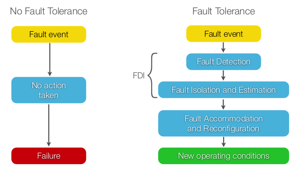
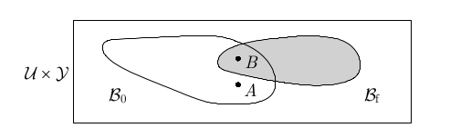

# Lecture 01: Fundamentals

## Motivation
Resilience and robustness of control systems. Especially interesting for smart buildings and aerospace applications. 

Content of the course (roughly)

- Analyse structure of a system and carry out Fault Tree (FT) and Fault Modes and Effects Analysis (FMEA)
- Analyse anomalies that occur
- Design an algorithm for detecting, isolating and identifying faults
- Design policies for reconfiguration in order to accommodate faults

The goal is to detect anomalies and apply suitable interventions to guarantee safety of the system.

{width=40%}

Control systems can be subdivided into the following components which can be considered attack vectors:

- Controller, subject to cyber-physical attacks
- Field bus/WAN for communication between sensors, actuators and controllers
- Actuators
- Sensor
- The physical plant, usually not subject to cyber attacks, but can be attacked physically

## Definitions and Models

\fbox{\parbox{\columnwidth}{
\textbf{Definition \textnormal{(Hardware Redundancy)}.}\textit{
Have redundancy of components at the hardware level to ensure robustness to sensor or actuator faults. In case of sensors this allows for \textbf{majority voting}. Hardware redundancy can be applies to sensors, actuators and controllers.
}}}

\fbox{\parbox{\columnwidth}{
\textbf{Definition \textnormal{(Physical Redundancy)}.}\textit{
A static, passive tolerance approach. Over-design components such that they cannot fail for the used application. E.g. over-spec motors or expensive reliable sensors. Design approach is robust in the sense the system will work even if components fail. Think of spokes in a bike wheel, threads in a rope, cables on a bridge.
}}}

\fbox{\parbox{\columnwidth}{
\textbf{Definition \textnormal{(Analytical Redundancy)}.}\textit{
A dynamic switching approach where sensors are made redundant by mathematical models. E.g. sensor fails, this is detected by a FDA (Fault Detection Algorithm) and this sensor is switched to a virtual sensor (Oberserver).
}}}

\begin{table}[h]
\centering
\caption{An overview of different redundancy types and their pros and cons}
\begin{tabular}{cccc}
    \toprule
    & \textbf{Hardware} & \textbf{Physical} & \textbf{Analytical}\\
    \hline
    Pros & No perf. loss  & Best if in budget & most efficient\\
    \hline
    Cons & Costly & Cost & perf. loss\\
    \bottomrule
\end{tabular}
\end{table}

\fbox{\parbox{\columnwidth}{
\textbf{Definition \textnormal{(Faults and Failures)}.}\textit{
Faults reduce functionality or performance while failures render the system inoperable. Formally:
A \textbf{fault} in a dynamical system is an un-permitted deviation from the nominal situation of at least one characteristic property of the system.
A \textbf{Failure} is a permanent interruption of a systems ability to perform a required function.
}}}

\fbox{\parbox{\columnwidth}{
\textbf{Definition \textnormal{(Reliability)}.}\textit{
Reliability of a system in the ability to perform a required function under stated conditions within a given scope during a given period of time.
}}}

As in some sense the inverse of faults and failures we have reliability. Mathematically we can define the Mean Time to Failure (MTTF):
$$
\text{MTTF} = \frac{1}{\lambda}
$$
Where $\lambda$ is the average number of failures per unit of time. The availability also follows from this. This can be viewed as the probability that a system or equipment will operate satisfactorily at any period of time:
$$
A = \frac{\text{MTTF}}{\text{MTTF} + \text{MTTR}}
$$
Where MTTR is the Mean Time To Repair. Note that lower MTTR (short repair time) means more availability and larger MTTF means higher availability.

\fbox{\parbox{\columnwidth}{
\textbf{Definition \textnormal{(Fault Detection and Diagnosis)}.}\textit{
Fault detection is the determining of the presence of a fault in a given system at a given time.
\textbf{Fault diagnosis} is more broad and consists of determining the presence, type, size and location of a fault in a given system at a given time, assuming knowledge of the possible faults.
}}}

\fbox{\parbox{\columnwidth}{
\textbf{Definition \textnormal{(Fault Tolerance)}.}\textit{
Fault tolerance is the possibility of achieving (control) objectives in the presence of a given (set of) fault(s). It can be interpreted as robustness to faults in the sense that we contain the consequences of faults and failures thus that the components remain functional.
}}}

\fbox{\parbox{\columnwidth}{
\textbf{Definition \textnormal{(Nominal Behaviour)}.}\textit{
All faults and failures refer to nominal conditions. Nominal behaviour is defined as the expected or desired behaviour w.r.t. control objectives.
}}}

{width=40%}

For dynamical systems, we generally use the following models:
$$
\begin{cases}
\dot x = g(x, u, w, f)\\
y = h(x, u, v)
\end{cases}, \quad
\begin{cases}
x_{k+1} = g(x_{k}, u_{k}, w_{k}, f_{k})\\
y_{k} = h(x_{k}, u_{k}, v_{k})
\end{cases}
$$
Where $x\in\R^{n}$ is the system state $u\in \R^{m}$ the input, $w\in \R^{p}$ the exogeneous inputs and disturbances, $f$ the (set of) faults and $v\in\R^{q}$ the sensor noise.

### Types of Faults

- Abrupt, the fault is not there until it abruptly is and stays
- Incipient, the faulty behaviour slowly grows over time
- Intermittent, the fault abruptly happens and then disappears again intermittently

Faults can strike at many locations:
\begin{align*}
    \tilde u &= u\cdot(1 + f) \quad \text{(Actuator)}\\
    \dot x &= \tilde g(\cdot) \quad \text{(Plant)}\\
    \tilde y &= y + f \quad \text{(Sensor)}
\end{align*}
Faults can be additive ($\tilde y = y+f$), multiplicative $(\tilde y = y \cdot (1 + f)$) or general $\tilde y = f(y)$.

## Fault Diagnosis
Diagnosis can be signal based or model based. Examples:

- Signal Based
    - Raw signal
    - Mean or variance over moving window
    - Peak values
    - Fourier transform, STFT, Wavelet, etc.
    - Machine Learning model based on nominal behaviour
- Model Based
    - (Kalman) Observer, estimation errors
    - Parity Relations for error
    - Model parameter estimates and check whether these match nominal

A **symptom** is the difference between actual value of features extracted from observations and nominal ones. Examples are for example unexpected or unexplainable spikes in the power of a specific frequency. In the model based case we may observe an estimate of a spring constant over time and see how this matches the nominal behaviour. 

Physiological changes shall be ignored but pathological changes are evaluated in the next step. A measure of a symptom is so compared against a known pathological threshold. In general this is a change detection problem.

\begin{enumerate}
    \item \textbf{Detection}, testing the null hypothesis $\mathcal{H}_{0}$: "the sytsem is behaving in a nominal way"
    \item \textbf{Isolation}, testing the $N$ faulty hypotheses: $\mathcal{H}_{i}$: "the system is behaving as if the $i$-th fault is present"
    \item \textbf{Identfication/Estimation}, if $\mathcal{H}_{0}$ and every but one $\mathcal{H}_{i}$ are falsified, then estimate parameters of the $i$-th fault. Note that if $\mathcal{H}_{0}$ and every $\mathcal{H}_{i}$ are falsified, we identify a model of a new fault
\end{enumerate}
