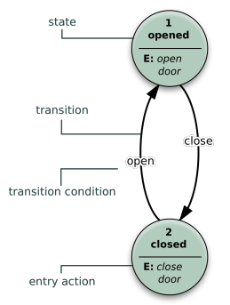
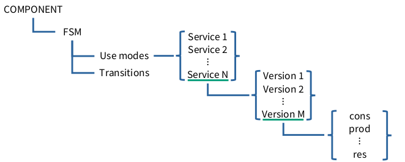
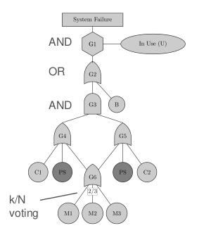
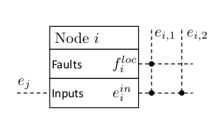

# Lecture 02: Structural Analysis

## Graphs
Let $\mathcal{G} = (\mathcal{V}, \mathcal{E})$ denote a graph with set of vertices (nodes) $\mathcal{V}$ and set of edges $\mathcal{E}$. For example:
$$
\mathcal{V} = \{1, 2, 3, 4\}, \quad \mathcal{E} = \{e_{12}, e_{23}, e_{34}\}
$$
We can also represent this in terms of an adjacency matrix $A$. Note that $|\mathcal{V}| = n$ and $A \in \R^{n\times n}_{\text{sym}}$ (or asymmetric when the graph is directed) with the property $\text{tr}(A) = 0$. The adjacency matrix has $0$ for nodes not connected by edges (with self-connection being $0$). Then for the example above we write
$$
A = \begin{bmatrix}
    0 & 1 & 0 & 0\\
    1 & 0 & 1 & 0\\
    0 & 1 & 0 & 1\\
    0 & 0 & 1 & 0\\
\end{bmatrix}
$$

There are many graph structures, implicitly we assume that all of them are strongly connected and undirected. For example:

- Random, all nodes connected at random with one another
- Regular, all nodes have at most degree 2
- Complete, every node is connected to every other node
- Disconnected, NOT strongly connected
- Tree, has a root and trunk and branches to this trunk, no redundant edges so only 1 path from each node to every other node
- Bipartite, nodes are divided in different sets, no interconnection between nodes in the same set BUT there are connection to nodes in other sets

Edge weights can encode properties such as cost, time, distance, etc. We can then define for example linear programs on these graphs or apply algorithms such as Dijkstra, A\*\footnote{A\* is Dijkstra with an extra heuristic function to guide the search.} to find the shortest path through this graph.

Edges can also be conditional (flowcharts) or probabilistic (Markov Chains). Important for dynamical systems are finite automaton which model state transition graphs.

For the state transition graph, we model:

- Nodes &rarr; states
- Edges &rarr; transitions
    - Typically modelled as boolean functions of an input, so for example $\textit{Open}: \mathbb{U} \to \mathbb{B}$, where $\mathbb{B} = \{0,1\}$ and $\mathbb{U}$ is the set of inputs (e.g. $\mathbb{U} = \{\text{Open Door}, \neg \text{Open Door}\}$
- As an extra, some states may have an output function per each state (i.e. specific outputs may be given upon output of a state).

{width=20%}

## Structural Bi-partite Graphs

\fbox{\parbox{\columnwidth}{
\textbf{Definition \textnormal{(Bipartite Graphs)}.}\textit{
Let $\mathcal{G} = ((\mathcal{C}, \mathcal{Z}), \mathcal{E})$. Here $\mathcal{C}$ are the constraints, $\mathcal{Z}$ are the variables and $\mathcal{E}$ is the set of connecting edges. The constraints typically represents our equations. We can further split 
$$
\mathcal{Z} = \{\mathcal{K}, \mathcal{X}\}
$$
Where $\mathcal{K}$ are known variables and $\mathcal{X}$ unknown variables. We can split
$$
\mathcal{C} = \{\mathcal{C}_{\mathcal{K}}, \mathcal{C}_{\mathcal{X}}\}
$$
Where $\mathcal{C}_{\mathcal{K}}$ are known and $\mathcal{C}_{\mathcal{X}}$ are unknown.
}}}

\begin{figure}
\center

\begin{tikzpicture}[line width=1pt]
  % Variables (top circles)
  \node[circle, draw=red, minimum size=0.4cm, label=above:$z_{1}$] (z1) at (0,2) {};
  \node[circle, draw=red, minimum size=0.4cm, label=above:$z_{2}$] (z2) at (2,2) {};
  \node[circle, draw=red, minimum size=0.4cm, label=above:$z_{3}$] (z3) at (4,2) {};
  \node[circle, draw=red, minimum size=0.4cm, label=above:$z_{4}$] (z4) at (6,2) {};

  % Constraints (bottom red rectangles)
  \node[rectangle, draw=red, minimum width=0.8cm, minimum height=0.2cm, label=below:$c_{1}$] (c1) at (0,0) {};
  \node[rectangle, draw=red, minimum width=0.8cm, minimum height=0.2cm, label=below:$c_{2}$] (c2) at (2,0) {};
  \node[rectangle, draw=red, minimum width=0.8cm, minimum height=0.2cm, label=below:$c_{3}$] (c3) at (4,0) {};

  % Arrows (edges)
  \draw[blue] (z1) -- (c1);
  \draw[blue] (z2) -- (c1);
  \draw[blue] (z2) -- (c2);
  \draw[blue] (z3) -- (c2);
  \draw[blue] (z3) -- (c3);
  \draw[blue] (z2) -- (c3);
  \draw[blue] (z4) -- (c3);
\end{tikzpicture}
\caption{Example of a bi-partite graph with states $z_{i}$ and constraints $c_{i}$}
\end{figure}

An example of a bi-partite graph can be nodes $z_{i}$ and constraints $c_{i}$ where 
$$
\begin{align*}
c_{1}:&\quad z_{1} = 2z_{2}\\
c_{2}:&\quad z_{2} = 3z_{3}\\
c_{3}:&\quad z_{1} + z_{2} + z_{3} = 1
\end{align*}
$$
Now presume that $z_{1}$ and $z_{2}$ are known and $z_{3}$ and $z_{4}$ are not known. Based on the graph we can graphically inspect (without looking at constraint equations) and find that $c_{2}$ depends on $z_{2}$ and $z_{3}$, so we can use this to compute $z_{3}$. $c_{3}$ depends on $z_{2}$ (known), $z_{3}$ unknown but computable from $c_{2}$ and $z_{4}$, so we can also compute $z_{4}$.

\fbox{\parbox{\columnwidth}{
\textbf{Example \textnormal{(Bipartite Graph Model for a single tank system)}.}
Consider a simplified $1$ tank model. By modelling the dynamical system we find the following constraint equations:
$$
\begin{align*}
    \text{Tank }c_{1}: \quad &\dot h(t) = q_{i}(t) - q_{o}(t)\\
    \text{Input Valve }c_{2}: \quad &q_{i}(t) = \alpha u(t)\\
    \text{Output Valve }c_{3}: \quad &q_{o}(t) = k\sqrt{h(t)}\\
    \text{Level Sensor }c_{4}: \quad &y(t) = h(t)\\
    \text{Integration }c_{5}: \quad &h(t) = \int_{t_{0}}^{t} \dot h(s)\; ds
\end{align*}
$$
We consider the input measurement and system parameters $\alpha$ and $k$ to be known. We consider $h$, $\dot h$, $q_{i}$ and $q_{o}$ to be unknowns. The bi-partite graph below shows a graphical representation of this system. This reveals and \textbf{analytical redundancy} of the output $y$! We can use a virtual sensor (Luenberger Observer/Kalman Filter) to estimate $y$ in the case that the sensor fails, which easily follows from graphical analysis of the graph below.\\

\begin{center}
\definecolor{forestgreen}{rgb}{0.0, 0.39, 0.0}
\begin{tikzpicture}[line width=1pt, scale=1.5]
  % Nodes: Variables (red circles)
  \node[circle, draw=forestgreen, fill=white, inner sep=2pt, label=left:$u$] (u) at (0,2) {};
  \node[circle, draw=red, fill=white, inner sep=2pt, label=right:$q_{i}$] (qi) at (2,2) {};
  \node[circle, draw=red, fill=white, inner sep=2pt, label=left:$q_{o}$] (q0) at (2,1) {};
  \node[circle, draw=forestgreen, fill=white, inner sep=2pt, label=left:$k$] (k) at (0,1) {};
  \node[circle, draw=forestgreen, fill=white, inner sep=2pt, label=left:$\alpha$] (alpha) at (0,1.5) {};
  \node[circle, draw=red, fill=white, inner sep=2pt, label=right:$\dot h$] (h1) at (3,1.5) {};
  \node[circle, draw=red, fill=white, inner sep=2pt, label=right:$h$] (h2) at (3,0.5) {};
  \node[circle, draw=forestgreen, fill=white, inner sep=2pt, label=left:$y$] (y) at (0,0) {};

  % Constraints (red rectangles)
  \node[rectangle, draw=red, minimum width=0.2cm, minimum height=0.6cm, label=below:$c_{2}$] (c2) at (1,2) {};
  \node[rectangle, draw=red, minimum width=0.6cm, minimum height=0.2cm, label=left:$c_{1}$] (c1) at (2,1.5) {};
  \node[rectangle, draw=red, minimum width=0.6cm, minimum height=0.2cm, label=below:$c_{3}$] (c3) at (2,0.5) {};
  \node[rectangle, draw=red, minimum width=0.2cm, minimum height=0.6cm, label=above:$c_{4}$] (c4) at (1,0) {};
  \node[rectangle, draw=red, minimum width=0.6cm, minimum height=0.2cm, label=left:$c_{5}$] (c5) at (3,1) {};

  % Edges (thick blue lines)
  \draw[blue] (u) -- (c2) -- (qi);
  \draw[blue] (alpha) -- (c2);
  \draw[blue] (qi) -- (c1) -- (h1);
  \draw[blue] (k) -- (c3);
  \draw[blue] (c1) -- (q0);
  \draw[blue] (q0) -- (c3) -- (h2);
  \draw[blue] (y) -- (c4) -| (h2);
  \draw[blue] (c5) -- (h1);
  \draw[blue] (c5) -- (h2);
\end{tikzpicture}
\end{center}
}}

Note that this example is relatively simple. In the case that we have a more complex system (e.g. a building HVAC system), we can subdivide this system into components. We then build bi-partite graphs for each of these components and interconnect these with one another. To then determine analytical redundancies (i.e. detectability of states) we can traverse the graph and try to find a path from known variables to unknown variables. If such a path exists, then there is analytical redundancy.

## Components and Service Models
Components and service models are a way to organise knowledge of the system (nominal behaviour) in a hierarchical way. This allows for fault propagation and effects as well as root causes analysis.

To do this, we divide this system into subsystems. All of these subsystems consist of components, which have lower level nodes called services. These services are e.g. operating modes of the component. Finally, the services can be described by a set of (non-linear) differential equations ($\dot x = f(t, x, u)$). From this structure,  a tree graph naturally arises. This tree clearly shows how faults propagate through the system.

As an example, consider a measurement sub-system with sensors that each have 2 services, normal operation and self-calibration. These sensors are not redundant versions of the same sensor but instead different kind of sensors (e.g. Temperature, pressure, etc.) In the case 1 of these sensors fails, the sensor sub-system also fails. If the sensor system fails and we do not have analytical redundancy to (temporarily) mitigate this, the entire system fails as we now do not know what it is doing and hence cannot control it.

\fbox{\parbox{\columnwidth}{
\textbf{Definition \textnormal{(Formal Definition of a service)}.}\textit{
A service $s_{i}$ is described by a $6$-tuple given as
$$
s = ( \text{cons}, \text{prod}, \text{proc}, \text{rqst}, \text{enable}, \text{res},)
$$
Where cons are the consumed variables, proc are the produced variables, proc is the process (dynamic equations modelling the relation between consumed and produced variables). The rqst are the requests as some components only provides services on request. $\text{enable}$ shows whether the component is operating, which can be conditional on e.g. other components failing. Finally, res are the resources which are the (physical) parts of the component.
}}}

{width=45%}

\fbox{\parbox{\columnwidth}{
\textbf{Definition \textnormal{(General Component Model)}.}\textit{
Component $k$ is defined by a state transition graph $\mathcal{G}(M(k), \tau(k), m^{0}(k)$, where 
\begin{itemize}
   \item $M(k)$ is the set of use modes
   \item $\tau(k)$ is the set of mode transitions
   \item $m^{0}(k)$ are the initial use modes
   \item use-mode $m_{i}(k)$ is a set of services $s_{i}(k) \subseteq s(k)$
   \item service $s_{\ell}(k)$ are the pre-ordered versions
   \item version $s^{j}_{\ell}(k)$ is version $j$ of service $\ell$ which has a $6$-tuple as defined formally in the service definition
   $\tau_{ij}(k)$ is a $3$-tuple $(c_{ij}(k), m_{i}(k), m_{j}(k))$  defining the transition from mode $m_{i}(k)$ (origin) to $m_{j}(k)$ (destination) in the case that condition $c_{ij}(k)$ is met.
\end{itemize}
}}}

### Boolean Algebra
Boolean algebra is algebra on boolean variable $\delta \in \mathbb{B} = \{0, 1\}$. We have the following operations define on $\mathbb{B}$:
\begin{align*}
A \wedge B &= \begin{cases}
1, \quad \text{ if } A = 1,\; B = 1\\
0, \quad \text{ otherwise}
\end{cases}\\
A \vee B &= \begin{cases}
1, \quad \text{ if } A = 1 \text{ or } B = 1 \text{ or } A = B = 1\\
0, \quad \text{ otherwise}
\end{cases}\\
\neg A &= \begin{cases}
1, \quad \text{ if } A = 0\\
0, \quad \text{ otherwise}
\end{cases}\\
\langle A_{1}, \cdots , A_{N}\rangle_{k} &= \begin{cases}
1, \quad \text{ if at least $k$ $A_{i} = 1$} \\
0, \quad \text{ otherwise}
\end{cases}
\end{align*}
From top to bottom we have: "and", "or", "not" and "majority vote".

\fbox{\parbox{\columnwidth}{
\textbf{Theorem \textnormal{(De Morgan's Laws)}.}\textit{
Let $A, B \in \mathbb{B}$. Then 
\begin{gather*}
\neg(A \wedge B) \iff \neg A \vee \neg B\\
\neg(A \vee B) \iff \neg A \wedge \neg B\\
\end{gather*}
}}}

\fbox{\parbox{\columnwidth}{
\textbf{Theorem \textnormal{(Disjunctive Normal Form)}.}\textit{
The disjunctive normal form is a canonical form of semantic (logic) functions and is given by the disjunction (or) of several conjunctions (and). We write
$$
f(A_{1}, \cdots , A_{N}) = \bigvee\left(\bigwedge_{j} A_{j}\right)
$$
for example
$$
f(A, B, C, D) = 
(A \wedge B) \vee 
(C \wedge D) \vee 
(A \wedge D)
$$
}}}

\fbox{\parbox{\columnwidth}{
\textbf{Definition \textnormal{(Boolean Matrix-Vector Product)}.}\textit{
Given $M \in \mathbb{B}^{m\times n}$ and $f\in \mathbb{B}^{n}$. We denote $e = M \otimes f$ which is represented as
$$
e_{(i)} = (M_{(i, 1)} \wedge f_{(1)}) \vee \cdots \vee (M_{(i, n)} \wedge f_{(n)})
$$
}}}

\fbox{\parbox{\columnwidth}{
\textbf{Definition \textnormal{(Inverse Inference Operator)}.}\textit{
Given $M \in \mathbb{B}^{m\times n}$. $f= M^{T} \odot e$ represent the logical function
$$
f_{(i)} = (M_{(1, i)} \equiv f_{(1)}) \vee \cdots \vee (M_{(n, i)} \equiv e_{(m)})
$$
}}}

## Fault Tree Analysis 
Fault trees are an important tool (diagnosis method) for determining the effect of component failure on system dependability. 

\fbox{\parbox{\columnwidth}{
\textbf{Fault Tree Objective.}\textit{
Determine whether the failure of a (subset of) component(s) can lead to the failure of the whole system
}}}

It is enough to have qualitative knowledge on the system. We break down the system by analysing what **components** make up the system, what **services** these components offer and how these components are **interconnected**.

The process of identification of a fault tree is usually the following:

- Identification of components
- Represent how the components compose subsystems and how subsystems compose the system.

A Fault tree is a **directed, acyclic graph** (not necessarily a tree graph), where the leaves represent component failures (basic events) which are interconnected through logic gates. The root node is the top event, representing complete system failure. Note that fault trees represent propagation of failure (i.e., when component failure leads to system failure).

{width=30%}

\fbox{\parbox{\columnwidth}{
\textbf{Definition \textnormal{(Fault Tree)}.}\textit{
A Fault tree is a tuple
$$
F = (\mathcal{E}_{B}, \mathcal{G}, T, I)
$$
Where $\mathcal{E}_{B}$ is a set of basic events $e\in \mathcal{E}_{B}$ and $e \in \mathbb{B}$ (with $0$ denoting healthy and $1$ faulty). $\mathcal{G}$ is a set of gates, $T: \mathcal{G} \to \{\wedge, \vee, \neg, \langle \cdot \rangle_{k}\}$ us a function which maps hates to types. Finally $I: \mathcal{G} \to \mathcal{P}(\mathcal{E})$ is a function which maps gates to their input with $\mathcal{P}(\cdot)$ denoting the powerset and $\mathcal{E} = \mathcal{E}_{b} \cup \mathcal{G}$.
}}}

Each fault tree has a semantic function associate to it:
$$
\pi_{F}: \mathcal{P}(\mathcal{E}_{B}) \times \mathcal{E} \to \mathbb{B}
$$
Where $\pi_{F}(S, e_{i}) = 1$. If $e_{i} \in \mathcal{E}$ is a failure ($e_{i} = 1$) when all elements of $\mathcal{S}\subset \mathcal{P}(\mathcal{E}_{B})$ are failures. We use shorthand notation $\pi_{F}(S)$ if $e_{i}$ is the top event. $\pi_{F}(S)$ represents the effect of component failure on system health.

\fbox{\parbox{\columnwidth}{
\textbf{Definition \textnormal{((Minimal) Cut Sets)}.}\textit{
A set $\mathcal{C}\subseteq \mathcal{E}_{B}$ is a cut set of $F$ if $\pi_{F}(\mathcal{C}) = 1$. The cut set is a minimal cut set if no subset of the cut set is itself a cutset. That is
$$
\pi_{F}(\mathcal{C}) = 1 \wedge \pi_{F}(\mathcal{C}') = 0\quad \forall \mathcal{C}' \subset \mathcal{C}
$$
}}}

An important method for quantitative analysis of fault trees is the structure function 
$$
f: \mathbb{B}^{N} \to \mathbb{B}
$$
where $N = |\mathcal{E}_{B}|$ are the amount of leaves of the fault tree. This function tells us when the values $e_{i}$ result in a failure at the top event. $f(\cdot)$ can be represented in canonical form (disjoint normal form) where each conjunction in $f$ is a minimal cut set!

Note that there are many more flavours of fault tree not covered: probabilistic fault trees for reliability, propagating probability of failure, analysis of mean-time to failure, dynamic fault trees, repairable fault trees.

## Failure Mode and Effect Analysis
FMEA is meant to analyse the effect of component failure on system dependability. 

\fbox{\parbox{\columnwidth}{
\textbf{Failure Mode and Effect Analysis Objective.}\textit{
Determine how the failure of a (subset of) component(s) can lead to the failure of the whole systems.
}}}

\fbox{\parbox{\columnwidth}{
\textbf{Note \textnormal{(Difference between FTA and FMEA)}.}
FTA is only concerned with \textbf{whether or not component failure can result in system failure}. The main differnce with FMEA is that FMEA actually analyses how this happens.
}}

For FMEA we need fault/failure modes of each component, effect of each mode at the component level and how the mode of one component affects the connected components. We can again represent FMAE using a graph. Each node in the graph is associate with a component. Then local faults are denoted $f_{i}^{\text{loc}}$, local effects denoted $e_{i}$ and inherited effects are $e_{i}^{\text{in}}$ (inherited effects are local effects of other nodes so $e_{i}^{\text{in}} = e_{j}$).

{width=30%}

Note that for FMEA, boolean matrix-vector products are particularly useful as the fault propagation can be represented by the boolean mapping
$$
e = M \otimes f
$$
Where $f$ are faults and $e$ are the effects. Note that this puts faults (causes) in relation to effects. For Fault diagnosis purposes we are interested in the inverse relation: "Given these effects, what faults cause these?". This is the inverse inference problem and is closely related to the problem of isolation. Note that this mapping in general is surjective (not bijective). For any given effect there may be multiple faults that cause this effect.
