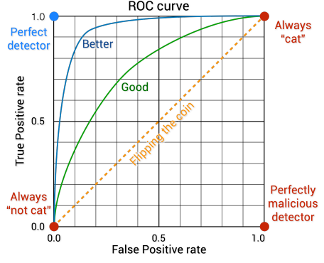

# Lecture 03: Change Detection Algorithms
## Introduction to Change Detection
Probabilistic detection algorithms are based on hypothesis testing. To do fault detection and diagnosis with hypothesis testing we have the following 3 step process:

1. **Detection**. Testing the _null hypothosis_:
    $$
    \mathcal{H}_{0}: \text{"The system is behaving in a nominal way"}
    $$
2. **Isolation**. Testing the _$N$ faulty hypotheses_:
    $$
    \mathcal{H}_{i}: \text{"The system is behaving as if $i$-th fault present"}
    $$
3. **Identification and Estimation**. If everyone by $\mathcal{H}_{i}$ falsified, estimate the parameters of the $i$-th fault. If every $\mathcal{H}_{i}$ is falsified, identify a model of a new fault.

It is important to classify different kinds of results from hypothesis testing to distinguish between True positive, False positive etc.

We use the following definitions for detection errors and detection performance

\fbox{\parbox{\columnwidth}{
\textbf{Definition \textnormal{(Detection Errors)}.}\textit{
We define the 
\begin{itemize}
    \item \textcolor{green!70!black}{\textbf{True Positive}}: $TP := \# \neg \mathcal{H}_{0}(F)$
    \item \textcolor{green!70!black}{\textbf{True Negative}}: $TN := \# \mathcal{H}_{0}(H)$
    \item \textcolor{red}{\textbf{False Positive}}: $FP := \# \neg \mathcal{H}_{0}(H)$
    \item \textcolor{red}{\textbf{False Negative}}: $FN := \# \mathcal{H}_{0}(F)$
\end{itemize}
}}}

\fbox{\parbox{\columnwidth}{
\textbf{Definition \textnormal{(Detection Performance)}.}\textit{
We define 
\begin{itemize}
    \item \textcolor{red}{\textbf{False Positive Rate}}: $FPR := \frac{FP}{FP + TN}$
    \item \textcolor{green!70!black}{\textbf{True Negative Rate}}: $TNR = 1 - FPR$
    \item \textcolor{green!70!black}{\textbf{True Positive Rate}}: $TPR = \frac{TP}{TP+FN}$
    \item \textcolor{red}{\textbf{False Negative Rate}}: $FNR := 1 - TPR$
    \item \textcolor{green!70!black}{\textbf{Accuracy}}: $ACC = \frac{TP + TN}{TP+FP + TN + FN}$
    \item \textcolor{green!70!black}{\textbf{Recall}}: $RE = \frac{TP}{TP + FN} = TPR$
\end{itemize}
}}}

{width=35%}

\fbox{\parbox{\columnwidth}{
\textbf{Problem \textnormal{(Chnage Detection Problem)}.}\textit{
The behaviour of the system is described by a parameter $\theta$. This parameter changes from nominal value $\theta_{0}$ to fault $\theta_{1}$ at time instant $k_{0}$. We measure the symptom $z(k)$. The goal is to estimate $k_{0}$ and $\theta_{1}$ by observing sympton $z(k)$ and system behaviour.
}}}

## Deterministic Tests: Limit Check
The most basic deterministic test is limit checking. We are given the minimum and maximum values, which are used to determine whether $z(k)$ is in a known range. In the scalar case:
$$
z(k) \notin [z_{\min}, z_{\max}] \implies \text{Alarm}
$$
Some pros of this approach are that it is simple to define, check and implement. There are no false positives, however the approach is overly conservative and only works in steady state.
In the case that $z(k)\in \R^{n}$ is vector valued, we define a scalar valued evaluation function of $z(k)$ to reduce the problem to scalar limit checking
$$
Z = f_{\text{ev}}(z(k)), \; f_{\text{ev}}: \R^{n}\to \R
$$
There are many such examples, such as $p$-norms (squircles), quadratic forms (circles/ellipsoids), (transformed) rectangles (scaled infinity norm), general polynomials or convex hulls. The defined region need not be convex.

Given a sequence of vector valued symptoms $\{z(k)\}_{k=k_{1}}^{k_{2}}$, we again reduce this to a scalar problem by transforming the sequence to a scalar. For example

1. First over all components, then over time. Examples:
    \begin{align*}
        Z &= \|z(k)\|_p,[k_{1},k_{2}] = \sum_{k=k_{1}}^{k_{2}} \|z(k)\|_p \quad \text{Sum $L^{p}$ norms}\\
        Z &= \|\{z(k)\|_p\}_{k=k_{1}}^{k_{2}}\|_{\ell_{q}}\quad  \text{$\ell^{q}$ norm of $L^{p} norms$}
    \end{align*}
2. First over time, then over all components. Examples:
    \begin{align*}
        Z &= \left\| \sum_{k=k_{1}}^{k_{2}}\frac{z(k)}{k_{2}-k_{1}+1}\right\|_p \quad \text{$L^{p}$ norm of averages}\\
        Z &= \left\|\text{FFT}(\{z(k)\}_{k=k_{1}}^{k_{2}})\right\|_p\quad \text{$L^{p}$ norm of FFT}
    \end{align*}

Possible ways to improve this are time-varying limits based on operating conditions of the system, or do model based limit checking. In this case, these are also valid for non-steady state conditions.

## Basic Probabilistic Tests
By construction deterministic tests have zero FPR, however they can have very poor TPR (no-free-lunch principle). This is evident when $z$ might rarely take large values. Additionally, when data is generated by a random process with infinite support, which is practically speaking always the case, we cannot (easily) define $z_{\min}$ and $z_{\max}$.

The intuition behind statistical hypothesis testing is that we are checking whether our underlying PDF has changed from what we originally believe it to be.

1. Assume that under $\mathcal{H}_{0}$ data is generate by a random process with PDF $p_{0}(z)$
2. Collect actual data
3. Is the data likely to have been drawn from $p_{0}(z)$ or from another PDF?

The following quantities are of interest:

- $\mu_{0}$, True mean (known)
- $\hat \mu_{0}$, empirical mean ($\mathbb{E}\left[\hat \mu_{0}\right] = \mu_{0}$)
- $p_{\hat \mu_{0}}$, PDF of $\hat \mu_{0}$ (not PDF of data)
- $\mu_{\frac{\alpha}{2}}$, $\int_{-\infty}^{\mu_{\frac{\alpha}{2}}} p_{\hat \mu_{0}}(\mu)\, d \mu = \frac{\alpha}{2}$
- $\mu_{1-\frac{\alpha}{2}}$, $\int_{\mu_{1-\frac{\alpha}{2}}}^{\infty} p_{\hat \mu_{0}}(\mu)\, d \mu = \frac{\alpha}{2}$

\fbox{\parbox{\columnwidth}{
\textbf{Definition \textnormal{(p-values)}.}\textit{
The p-value of a given realisation $x^{*}$ of a random process $X$ is the probability that $X$ can take values more extreme than $x^{*}$.
}}}

Note that $p$-values are easy to abuse to care needs to be taken. It tells us how likely the data is given $\mathcal{H}_{0}$, NOT the other way around. The p-value does not give meaningful info (i.e. nonsense) if the hypothesis on the PDF or data was wrong in the first place.

\fbox{\parbox{\columnwidth}{
\textbf{Definition \textnormal{(Empirical Moments)}.}\textit{
Given observed data sequence over horizon $N$ $\{z(i)\}_{i=k-N+1}^{k}$, we compute the empirical mean over a sliding window as
$$
\hat \mu_{[k-N+1, k]} = \frac{1}{N}\sum_{i=k-N+1}^{k} z(i)
$$
and the empirical variance over a sliding window as
$$
\hat \sigma_{[k-N+1, k]}^{2} = \frac{1}{N-1}\sum_{i=k-N+1}^{k} (z(i) - \mu_{0})^{2}
$$
In the case that $\mu_{0}$ is not known, we use $\hat \mu_{[k-N+1, k]}$ in the computation of the variance. For compactness we will often denote $\hat \mu_{[k-N+1,k]} = \hat \mu(k)$.
}}}

Perhaps one of the most widely used and important statistical tests is the student t-test. This determines if the mean of a normal random variable changed relative to the null hypothesis. We assume nominal mean $\mu_{0}$ known, nominal variance unknown but constant. Empirical moments $\hat \mu(k)$ and $\hat \sigma^{2}(k)$ are estimated from the last $N$ samples.

\fbox{\parbox{\columnwidth}{
\textbf{Theorem \textnormal{(Student t-test)}.}\textit{
Assume normally distributed data. Let $\hat \mu(k)$, $\hat \sigma(k)$ be the sliding window empirical mean and variance, let nominal mean $\mu_{0}$ be known. We compute 
$$
t(k) = \frac{\hat \mu(k) - \mu_{0}}{\hat \sigma(k)/\sqrt{N}}
$$
If $|t| > t_{\alpha, N-1}$ reject the null hypothesis $\mathcal{H}_{0}$.
}}}

\fbox{\parbox{\columnwidth}{
\textbf{Theorem \textnormal{(Student t-test with unknown Mean)}.}\textit{
Estimate true mean before and after change as $\hat \mu_{0}(k) = \hat \mu_{[k - N_{0}+1, k]}$ and $\hat \mu_{1}(k) = \hat \mu_{[k,k + N_{1}-1]}$. Via the same procedure estimate $\hat \sigma_{0}^{2}$ and $\hat \sigma_{1}^{2}$. Compute the random variable
$$
\begin{gather*}
t(k) = \frac{\hat \mu_{0}(k) - \hat \mu_{1}(k)}{\sqrt{(N_{0}-1})\hat \sigma_{0}^{2}(k) + (N_{1} - 1)\hat \sigma_{1}^{2}(k)} \\ \times \sqrt{\frac{N_{0}N_{1}(N_{0}+N_{1} - 2)}{N_{0}+ N_{1}}}
\end{gather*}
$$
}}}

We can also test whether the variance of a normal random variable is changed relative from a known value $\sigma_{0}^{2}$.

\fbox{\parbox{\columnwidth}{
\textbf{Theorem \textnormal{($\chi^{2}$-test)}.}\textit{
Let $\hat \sigma_{0}^{2}$ be the known nominal variance. Compute the empirical variance $\hat \sigma^{2}(k)$ from previous $N$ samples. The following random variable is $\chi^{2}$ with $N-1$ degrees of freedom:
$$
\chi^{2}(k) = \frac{(N-1)\hat \sigma^{2}}{\sigma_{0}^{2}}
$$
If $\chi^{2}(k) > \chi_{N-1,1-\alpha}^{2}$, then reject the null hypothesis $\mathcal{H}_{0}$ with significance $\alpha$.
}}}

\fbox{\parbox{\columnwidth}{
\textbf{Theorem \textnormal{(F-test)}.}\textit{
The F-test is the same as the $\chi^{2}$-test but the nominal variance is not known. We compute empirical variance $\hat \sigma_{0}^{2}$ from previous $N_{0}$ samples, and we compute $\hat \sigma_{1}(k)$ from the next $N_{1}$ samples. The random variable with $(N_{0}-1,N_{1}-1)$ degrees of freedom. We compute the F-statistic as
$$
F(k) = \frac{\hat \sigma_{0}^{2}}{\hat \sigma_1^2}
$$
If $F > F_{N_{0}-1,N_{1}-1, 1-\alpha}$ then reject null hypothesis $\mathcal{H}_{0}$
}}}

\fbox{\parbox{\columnwidth}{
\textbf{Note \textnormal{(Limitations of Hypothesis Testing)}.}
To falsify the null hypothesis generally requires quite a large amount of samples both before and after the hypothetical change. This delays the detection and generally likelihood based algorithms such as CUSUM are better. This will be the topic of the next lecture.
}}

## Advanced Probabilistic Tests
### Mahalabonis Distance and Chebychev inequality
\fbox{\parbox{\columnwidth}{
\textbf{Definition \textnormal{(Mahalabonis Distance)}.}\textit{
Let $z\in\R^{n}$, then the Mahalbonis distance $d(z)$ with respect to mean $\mu$ and covariance $C$ is defined as 
$$
d(z) = \sqrt{(z- \mu)^{T}C^{-1}(z - \mu)}
$$
This distance models how far a sample is from its nominal distribution.
}}}

Let $\mathcal{H}_{0} = z \in \R^{n}$ be a random vector with known mean $\mu$ and covariance $C$. We can use the Chebychec inequality to test $\mathcal{H}_{0}$ with desired FPR (False Positive Rate, read: Confidence interval) $\alpha$. Note that the intuition is that we define the distance based on the center ($\mu$) and ellipsoid defined by $C$. The Mahalabonis distance is taking an ellipse, moving it to the origin, transforming it to a circle and then measuring the "distance" between an ellipsoid and the unit circle.

\fbox{\parbox{\columnwidth}{
\textbf{Definition \textnormal{(Chebychev Inequality)}.}\textit{
Let $z\in \R^{n}$ be a random vector and let $d(\cdot)$ denote the Mahalabonis distance. Then 
$$
\mathbb{P}(d(z) \geq \overline d) \leq \alpha
$$
with 
$$
\overline d = \sqrt{\frac{n}{\alpha}}
$$
Where $n$ is the number of dimensions and $\alpha$ the confidence interval (FPR).
}}}

\fbox{\parbox{\columnwidth}{
\textbf{Remark \textnormal{(Mahalabonis and Chebychev Testing)}.}
We can choose $\alpha$ as any value we want so we get to specify the false positive rate seemingly leading to a very nice, multivariate robust test. One of the problems however, is that we cannot specify the true positive rate and so this is somewhere between "flipping a coin" and "better" but we do not know where. The test also implicitly assumes that we are using Gaussian through ellipsoids, but data may in general not be Gaussian. This leads to ellipsoidal outer approximations of the general distribution shape (e.g. rectangle for uniform) which makes the test conservative as there is a region that is outside the approximated distribution that is covered by the ellipsoidal approximation.
}}

### Neyman-Pearson Testing
Consider now that we want to do multiple-hypothesis testing. Consider
\begin{align*}
    \text{null: } \mathcal{H}_{0}:& z\sim p_{\theta_{0}}\\
    \text{alternate: } \mathcal{H}_{1}:& z\sim p_{\theta_{1}}
\end{align*}

\fbox{\parbox{\columnwidth}{
\textbf{Problem \textnormal{(Multiple Hypothosis Testing)}.}\textit{
Design a function 
$$
d: \R \to \{\mathcal{H}_{0}, \mathcal{H}_{1}\}
$$
with a given false positive rate $\alpha$ and the highest possible TPR, then $d$ is said to be most powerful.
}}}

We formalize this problem above by deciding based on the likelihood ratio test. This is the ratio between the null hypothesis being true relative to the alternate hypothesis to be true.

This leads to the CUSUM test which is an application of the above where we approximate the expected values using a running sum and then look for drift changes over time.

\fbox{\parbox{\columnwidth}{
\textbf{Lemma \textnormal{(Simplified Neyman-Pearson)}.}\textit{
Let $g$ be defined as 
$$
d(z) = \frac{p_{\theta_{1}}}{p_{\theta_{0}}} 
\underset{\mathcal{H}_0}{\overset{\mathcal{H}_1}{\gtrless}} \lambda
$$
Where $\lambda$ is chosen such that FPR $= \alpha$. Then $d$ is the MP detector with FPR $\leq \alpha$.
}}}

\fbox{\parbox{\columnwidth}{
\textbf{Definition \textnormal{(Log Likelihood Ration (LLR))}.}\textit{
Define
$$
s(z) = \log\left(\frac{p_{\theta_{1}}(z)}{p_{\theta_{0}}(z)} \right)
$$
Where 
\begin{align*}
  \mathbb{E}\left[s|\mathcal{H}_{0}\right]  &= \int_{-\infty}^{\infty} s(z)p_{\theta_{0}}\, dz < 0\\
  \mathbb{E}\left[s|\mathcal{H}_{1}\right]  &= \int_{-\infty}^{\infty} s(z)p_{\theta_{1}}\, dz > 0
\end{align*}
Note the alternate sign.
}}}

\fbox{\parbox{\columnwidth}{
\textbf{Definition \textnormal{(CUSUM Test)}.}\textit{
Define 
$$
S(k) = \sum_{i=1}^{k} \log\left(\frac{p_{\theta_{1}(z(i))}}{p_{\theta_{0}}(z(i))}\right)
$$
Then we define $g(k) = S(k) - m(k)$ where $m(k) = \min_{i} S(i)$. Set
$$
d(k) = g(k) \underset{\mathcal{H}_0}{\overset{\mathcal{H}_1}{\gtrless}} \lambda
$$
Note that we take $\theta_{0}$ to be known, i.e. $\theta_{0} = (\mu_{0}, \sigma_{0}^{2})$. Now, how to choose $\theta_{1}$ and $\lambda$?
}}}

**Tuning $\mu_{1}$.** 

- Replace $\mu_{1}$ by the minimum change that we want to detect (both $\pm$ implies two-sided CUSUM).
- Estimate it from data, but this leads to a detection delay as we may need more samples past the point of failure to detect it as we need to fill the sliding window to detect the fault.

**Tuning $\lambda$.**

- Exact methods exist for specific distributions
- Otherwise use Empirical tuning
-   Run of series of MC simulations and compute detection time FPR and TPR as a function of $\lambda$.

### The Generalized Likelihood (GLR) Test
Estimate both the change time $k_{0}$ and new parameter $\theta_{1}$ by formulating it as an optimisation problem

\fbox{\parbox{\columnwidth}{
\textbf{Definition \textnormal{(Generalized Likelihood Test)}.}\textit{
The GLR makes a maximum likelihood estimate between the null and alernate hypothesis. It uses a double maximisation over the detection point in time $k_{0}$ and the parameter $\theta_{1}$. Let 
$$
S_{j}^{k}(\theta_{1}) = \sum_{i} \log\left(\frac{p_{\theta_{1}}(z(i))}{p_{\theta_{0}}(z(i))}\right)
$$
Then set 
$$
(\hat k_{0}, \hat \theta_{1}) \arg\left\{
\max_{1\leq k_{0}\leq k} \max_{\theta_{1}} S_{j}^{k}(\theta_{1})
\right\}
$$
And 
$$
g(k)
\max_{1\leq k_{0}\leq k} \max_{\theta_{1}} S_{j}^{k}(\theta_{1})
$$
}}}
