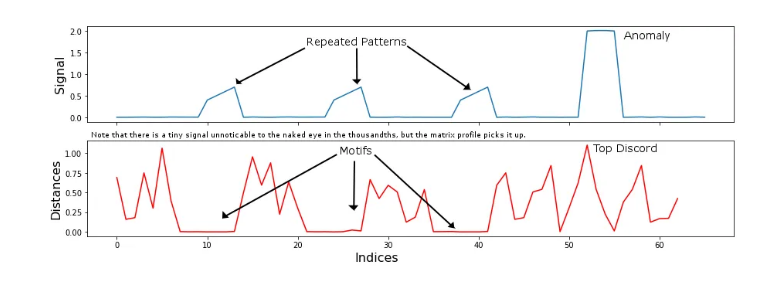
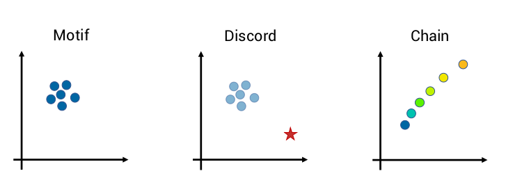

# Lecture 04: Signal Based Methods
## Introduction
In general fault detection in signal can be achieved in many ways. For example, when viewing the waveform, the audio may look normal, but the audio can sound perturbed. Transforming the data to different domains (e.g. spectogram) can also reveal more information. The goal now becomes to design an algorithmic way to detect these faults.

There are many methods we may apply to signal based fault detection. Some examples are Filtering, correlation analysis, spectrum analysis, ARMA parameter estimation, etc.

## Time Analysis
Time analysis are methods which rely on a time domain representation of the signal. All of the change detection and hypothesis testing methods discussed in lecture 3 apply. We can also do 

- Band-pass filtering
- Cross-correlation
- Auto-correlation

\fbox{\parbox{\columnwidth}{
\textbf{Definition \textnormal{(Auto-correlation)}.}\textit{
Let $x: [0, T] \to \R$ with $T \in \R_{+}$. The auto-correlation of the signal $x$ is the correlation between $x$ and a shifted version of itself:
$$
R_{xx}(\tau) = \lim_{T\to \infty} \frac{1}{T} \int_{0}^{T} x(t)x(t+\tau)\, d \tau
$$
}}}

\fbox{\parbox{\columnwidth}{
\textbf{Definition \textnormal{(Cross-correlation)}.}\textit{
Let $x: [0, T] \to \R$ and $y: [0, T] \to \R$ with $T \in \R_{+}$. The cross-correlation of the signals $x$ and $y$ is the correlation between $x$ and a shifted version of $y$:
$$
\begin{align*}
R_{xx}(\tau) &= \lim_{T\to \infty} \frac{1}{T} \int_{0}^{T} x(t)y(t+\tau)\, d \tau\\
=& \lim_{T\to \infty} \frac{1}{T} \int_{0}^{T} x(t-\tau)y(t)\, d \tau\\
\end{align*}
$$
}}}

## Frequency Analysis
Interest in frequency analysis was mainly driven by mechanical vibration analysis. It turns out that in general the tools used for frequency analysis are quite useful for generic signal analysis. Some tools used in this domain include the Fourier transform, the short time Fourier transform, wavelet analysis and the power cepstrum\footnote{This is not a typo, this is the actual name}. The last method (Power cepstrum) converts convoluted signals into sums of their cepstra for linear seperation.

\fbox{\parbox{\columnwidth}{
\textbf{Definition \textnormal{(Fourier Transform)}.}\textit{
Let $y: T \to \R$, $T = \R$. We define the Fourier transform, denoted as $Y(j\omega) = \mathcal{F}[y(t)]$, as
$$
Y(j \omega) = \int_{-\infty}^{\infty} y(t)e^{-2\pi j \omega t}\, dt
$$
}}}

\fbox{\parbox{\columnwidth}{
\textbf{Definition \textnormal{(Short Time Fourier Transform)}.}\textit{
Let $y: T \to \R$, and $w: T \to \R$ with $T = \R$. We define the Short Time Fourier transform, denoted as $Y(j\omega, \tau) = \mathcal{F}[y(t)w(t-\tau)]$, as
$$
Y(j \omega, \tau) = \int_{-\infty}^{\infty} (y(t)w(t-\tau))e^{-2\pi j \omega t}\, dt
$$
}}}

\fbox{\parbox{\columnwidth}{
\textbf{Definition \textnormal{(Power Cepstrum)}.}\textit{
Let $Y'(q)$ denote the power cepstrum, we define this as the squared magnitude of the inverse Fourier transform of the log of the power spectrum:
$$
Y'(q) = |\mathcal{F}^{-1}[\log(|\mathcal{F}[y(t)]|^2]|^2
$$
So it is the power of the inverse Fourier transform of the log of the power spectrum of the signal $y$.
}}}

For wavelet analysis see Graps 1995, An introduction to wavelets.

## Principle Component Analysis (PCA)
PCA is a dimensionality reduction technique that leverages SVD to find variations in the data. This works especially well for huge datasets of slow processes such as chemical reactors. The PCA projects the data in a few direction where the variance is largest. 

\fbox{\parbox{\columnwidth}{
\textbf{Procedure \textnormal{(PCA)}.}\textit{
Let $Z^{T} = \begin{bmatrix} z_{1} & \cdots & z_{N}\end{bmatrix} \in \R^{m\times N}$ be a matrix of normalised samples. First compute the covariance matrix using the sample covariance
$$
C = \frac{1}{N-1}Z^{T}Z
$$
Then compute the singular value decomposition of the sample covariance matrix such that 
$$
C = U \Lambda U^{T}
$$
such that $\Lambda = \text{diag}(\lambda_{1}, \cdots , \lambda_{m})$ with $\lambda_{i} \geq \lambda_{j}$ for all $i < j$. Keep the components with $\ell$ largest eigenvalues and partition
$$
C =
\begin{bmatrix}
    U_{pc} & U_{res}
\end{bmatrix} 
\begin{bmatrix}
    \Lambda_{pc} & 0\\
    0 & \Lambda_{res}
\end{bmatrix}
\begin{bmatrix}
    U_{pc}^{T}\\ U_{res}^{T}
\end{bmatrix}  \quad \Lambda_{pc}\in \R^{\ell \times \ell}
$$
}}}

To now use the described PCA above for detection of change in new data, we compute the thresholds for the squared prediction error (SPE) and Hotelling's $T^{2}$:
$$
J_{th, SPE} = \theta_{1}\left(
\frac{c_{\alpha}\sqrt{2 \theta_{2}h_{0}^{2}}}{\theta_{1}} + \frac{\theta_{2}h_{0}(h_{0} - 1)}{\theta_{1}^{2}} + 1
\right)^{1/h_{0}}
$$
where $h_{0}$ is compute using 
$$
h_{0} = 1 - \frac{2 \theta_{1}\theta_{3}}{3 \theta_{2}^{2}}.
$$
We also compute 
$$
J_{th,T^{2}} = \frac{\ell(N^{2} - 1)}{N(N - \ell)} F_{\alpha}(\ell, N-\ell)
$$
and 
$$
\theta_{i} = \sum_{j=\ell+1}^{m} (\lambda_{j})^{i} \quad i \in \{1,2,3\}
$$
We then compute the $SPE$ and $T^{2}$ for the data using 
$$
SPE = z^{T}P_{res}P^{T}_{res}z,\quad
T^{2} = z^{T}P_{pc}\Lambda_{pc}^{-1}P_{pc}^{T}z
$$
Then if $SPE \leq J_{th,SPE}$ and $T^{2}\leq J_{th,T^{2}}$ the system is fault-free, otherwise it is faulty.

## Matrix Profile
The matrix profile is a method for looking for self-similarity in time-series data. The intuition is that if a pattern is conserved, then there must be some sort of mechanism that causes this conservation. This leads to an anomaly detection technique. For example we may have a very regular pattern (motif) that gets broken (discord). The high-level description of the algorithm is as such:

1. Cut the time series into equi-length pieces
2. Compare each piece to every other piece
3. Very similar &rarr; Motif, very different &rarr; Discord.

The matrix profile can be thought of as a generalisation of harmonic analysis:

- sinusoidal patterns &rarr; Fourier Transform
- wave-like patterns &rarr; Wavelet Transform
- Shapelets (any repeating pattern) &rarr; Matrix Profile

There are several advantages to the Matrix profile algorithm. It is domain agnostic, fast and only requires a single parameter (window length). Though do note, the MP requires basic assumptions on repetition, steady-state behaviour and the choice of threshold is empirical (how dissimilar is discord?).

In order to define the matrix profile properly, we need to define the distance between sub-sequences. To do this, we use the normalized $\ell_{2}$ distance:

\fbox{\parbox{\columnwidth}{
\textbf{Definition \textnormal{(Normalized Euclidean Distance)}.}\textit{
Let $z_{1}, z_{2} \in\R^{m}$. Define 
$$
d(z_{1}, z_{2}) = \|\bar z_{1} - \bar z_{2}\|_2
$$
where $\bar z_{i}$ is the normalized distance given as
$$
\bar z_{i}(j) = \frac{z_{i}(j) - \mu_{i}}{\sigma_{i}}
$$
}}}

\fbox{\parbox{\columnwidth}{
\textbf{Theorem \textnormal{(Pearson's Correlation Distance)}.}\textit{
Let $\rho(z_{1}, z_{2})$ be Pearson's correlation coefficient of the sub-sequences defined as
$$
\rho(z_{1}, z_{2}) = \frac{\sum_{i=1}^{m}z_{1}(i)z_{2}(i) - m\hat \mu_{1}\hat \mu_{2}}{(m-1)\hat \sigma_{1}\hat \sigma_{2}}
$$
We can then rewrite the euclidean distance as
$$
d(z_{1}, z_{2}) = \sqrt{2m(1 - \rho(z_{1}, z_{2})}
$$
}}}

For the matrix profile we, for each row, find the minimal distance and find the associated indices. The computation of the algorithm would generally be $\mathcal{O}(n^{2})$, but efficient algorithms exist such that the run-time is $\mathcal{O}(n\log n)$. 

{width=40%}

One thing to watch for are chains. This will be registered as for example a Motif which steadily grows over time. Such anomalies may not be immediately obvious.

{width=40%}

