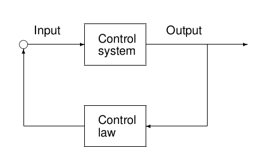

# Lecture 07: Stochastic Control Systems and Stochastic Control Problems

## Stochastic Control Systems

\fbox{\parbox{\columnwidth}{
\textbf{Definition \textnormal{(Stochastic Control System)}.}\textit{
Formally, we define a stochastic control system as a collection satisfying the relation
\begin{gather*}
\text{cpm}(\; (x(t+1), y(t))\; |\; F^{x-}_{t} \vee F^{y-}_{t-1} \vee F^{u-}_{t})\\ =
\text{cpm}(\; (x(t+1), y(t))\; |\; F^{x(t)} \vee F^{u(t)}) \; \forall t \in T
\end{gather*}
which implies that we have that the next state and current measurement and the previous measurements, states and control inputs are conditionally independent given the current state and input:
\begin{gather*}
(F^{x(t+1)} \vee F^{y(t)},\; F^{x-}_{t} \vee F^{y-}_{t-1} \vee F^{u-}_{t}\; |\; F^{x(t),u(t)}) \in CI\\ \forall t \in T
\end{gather*}
Where $u: \Omega \times T \to U$ is the input process, $c: \Omega \times T \to X$ the state process and $y: \Omega \times T \to Y$ the output process. If the above does not explicitly depend on time it is time-invariant and if $x_{0} \in G$ and $\text{cpm}$\footnote{cpm = conditional probability measure} is conditionally Gaussian, the system in Gaussian. We denote
$$
\{\Omega, F, P, T, Y, B_{Y}, X, B_{X}, U, B_{U}, y, x, u\} \in \text{StocCS}
$$
}}}
Less formally, we can represent the systems defined above in terms of a recursive system:
$$
x(t+1) = f(t, x(t), u(t), v(t)),\; x(0) = x_{0}
$$
where $F^{x_{0}}, F^{v}_{\infty}$ are independent for all $t \in T$. We also have that $F^{v(t)}, F^{u}_{t}$ also independent. This system is time invariant if $f$ is not explicitly dependent on time. In the Gaussian (linear) case we can write this recursion as
\begin{align*}
    x(t+1) &= A(t)x(t) + B(t)u(t) + M(t)v(t),\; x(t_{0}) = x_{0},\\
    y(t) &= C(t)x(t) + D(t)u(t) + N(t)v(t),
\end{align*}
Where $(A, M)$ is a supportable pair and $(A, B)$ a controllable pair. Additionally, we often have $n_{y} \leq n_{v}$ and $\rank(N) = n_{y}$, $\rank([M^{T}, N^{T}]) = n_{v}$.

One can use the characteristic equation to prove that this Gaussian representation conforms to the abstract definition above.

\fbox{\parbox{\columnwidth}{
\textbf{Definition \textnormal{(Controlled Output)}.}\textit{
Define the controlled output on a finite horizon of a Gaussian control system representation 
\begin{align*}
    x(t) &= C_{z}(t)x(t) + D_{z}(t)u(t),\; \forall t \in T \setminus \{t_{1}\}\\
    z(t_{1}) &= C_{z}(t_{1}) x(t_{1})
\end{align*}
}}}

## Stochastic Controllability
Informally, this concept is needed to define the set of a reachable states in finite time $t_{1}$. The idea is to go from input process on an interval and initial conditions to a conditional measure on the state at time $t_{1}$. See slide 21/62 of lecture 07 for more details on notation. Intuitively we know that the set of probability measures in generally strictly smaller than the set of all probability measures on the set $X$. We consider the set $P_{co}$ of control-objective probability measures, where 
$$
P_{co}(X, B(X)) \subseteq P_{c}(t_{1}, X, B(X))
$$
Where $P_{c}$ is the set of reachable measures and $P_{co}$ the set of measures that our control objective states we _want_ to reach.

We consider a system $\Sigma \in \text{StocCS}$. This is consdier stochasticalyl controllable in the control interval $T_{c}$ with respect to the control objective probability measure $P_{co}$ if 
$$
P_{co}(X, B(X)) \subseteq P_{c}(t_{1}, X, B(x)),\; T_{c} =\{t_{0}:t_{1}\} \subseteq T
$$
We also define stochastic co-controllability via a similar argument but this is practically not been applied in literature so far.

It can be shown that the set of reachable measures depends on $F^{x(t_{0})}$, $F^{u}_{t_{1}-1}$ and the conditional covariance of $x$ given the mentioned $\sigma$-algebras. We can control the mean, _but not the variance, as the variance does not depend on $u(t)$_.

Practically speaking, we can check whether the pair $(A, B)$ is controllable using 
$$
\rank(\mathcal{C}(A, B)) = \rank \left( \begin{bmatrix}
    B & 
    AB &
    \cdots &
    A^{n_{x}-1}B
\end{bmatrix}\right) = n_{x}
$$
Note that we need the property that $(A, M)$ is a supportable pair. If this is not the case, then part of the stochastic system is deterministic and we need to check other properties. As before, if the system is _not_ stochastically controllable, we can do a Kalman decomposition
\begin{gather*}
x(t+1) = 
\begin{bmatrix}
    A_{11} & A_{12}\\
    0 & A_{22}
\end{bmatrix} x(t) + \begin{bmatrix}
    B_{1}\\ 0
\end{bmatrix}u(t) +\begin{bmatrix}
    M_{1}\\ M_{2}
\end{bmatrix}v(t)\\
\text{s.t. $(A_{11}, B_{1})$ a controllable pair}
\end{gather*}

## Control Laws
For control we distinguish:

- Input process $y: \Omega \times T \to U$
- Control law $g: X \times T \to U$

In general 
$$
u(t) = g(t, x(t))
$$
In general a control law is more useful than an input trajectory. A control law is a mapping which specifies the control input for each state. 

We specify the information structure as a $\sigma$-algebra family $\{G_{t}, t \in T\}$ such that for all $t \in T$. $G_{t}$ specifies all the information available for the input $u(t)$. These are very useful for decentralized/distributed control. 

\fbox{\parbox{\columnwidth}{
\textbf{Definition \textnormal{(Special Information structuresc)}.}\textit{
Past-state information structure
$$
\{F^{x-}_{t}, \forall t\in T\},\; F^{x-}_{t} = \sigma(\{x(s), t_{0} \leq s \leq t\}
$$
Markov information structure
$$
\{F^{x(t)}, \forall t\in T\},\; F^{x(t)} = \sigma(\{x(t)\})
$$
Past-state information structure
$$
\{F^{y-}_{t-1}, \forall t\in T\},\; F^{y-}_{t-1} = \sigma(\{y(s), t_{0} \leq s \leq t-1\})
$$
Classical information structure
$$
\{H_{t}, \forall t \in T\}
$$
if there is only one controller with one information structure and 2 satisfies perfect recall:
$$
\forall t\in T,\; H_{t}\subseteq H_{t+1}
$$
}}}

We will generally work with past-state control laws (depend on past states) and Markov control laws (depend on current state).

### Closed-Loop systems

{width=40%}

Given Gaussian stochastic control system 
$$
\begin{cases}
x(t+1) = A(t)x(t) + B(t)u(t) + M(t)v(t)\\
z(t) = C_{z}x(t) + D_{z}(t)u(t)
\end{cases}
$$
with control law $g_{t}: X^{t+1} \to U$, define recursively the closed-loop Gaussian stochastic system
$$
\begin{cases}
x^{g}(t+1) = A(t)x^{g}(t) + B(t)g_{t}(x^{g}(0:t)) + M(t)v(t)\\
z(t) = C_{z}x^{g}(t) + D_{z}(t)g_{t}(x^{g}(0:t))
\end{cases}
$$

Note that the closed loop system $x^{g}$ is a Markov process under a Markov control law. Proof is on slide 49/62 lecture 7.

### Control Objectives
A control objective is a property that a control system can have, and that an engineer strives to attain. Important ones are:

- **Stability**, finite and bounded variance asymptotically
- **Assignment of Dynamics**, pole placement
- **Optimal Control**, minimize the cost function over all control laws
- **Robustness under uncertainty**, satisfactory dynamics under different operating conditions, unmodelled dynamics and exogenous pertubations.
- **Adaption**, satisfactory performance under slow variations over time (e.g. power systems where load varies over 24h each day).

\fbox{\parbox{\columnwidth}{
\textbf{Note.} The general stochastic control problem is then, given a stochastic control system, an information structure, a set of admissible control laws and a set of control objectives, synthesize a control law such that the closed-loop system satisfies the control objectives as well as possible.
}}

More on optimal control later, but generally the goal is to minimize a cost function $J(g)$ over all control laws $g$ such that the expected value of the (quadratic) cost function is minimized. More formally:
\begin{align*}
    x(t+1) &= Ax(t) + Bu(t) + Mv(t)\\
    y(t) &= Cx(t) + Du(t) + Nv(t)\\
    z(t) &= C_{z}x(t) + D_{z}u(t) + Nv(t)\\
    z(t_{1}) &= C_{z}x(t_{1});\\
    &J: G \to \R_{+},\\
    J(g) &= \mathbb{E}\left[z(t_{1})^{T}z(t_{1}) + \sum_{s=0}^{t_{1}-1}z(s)^{T}z(s)\right]
\end{align*}
Then we solve
$$
J^{*} = \inf_{g \in G}\; J(g) = J(g^{*})
$$

**Distinguish:**

- Control Synthesis: Develop control theory and design procedures. Develop approaches and procedures for finding control laws
- Control Design: Develop and compute actual control laws. Domain dependent and use simulation and testing
