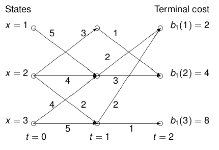

# Lecture 08: Optimal Stochastic Control with Complete Observations on a Finite Horizon

## Stochastic Optimal Control on a Finite Horizon

\fbox{\parbox{\columnwidth}{
\textbf{Problem \textnormal{(Optimal Stochastic Control on a finite horizon)}.}\textit{
Let 
\begin{align*}
    T &= \mathbb{N}_{t_{1}}\\
    X &= \R^{n_{x}},\; U = \R^{n_{u}}\\
    x(t+1) &= f(t, x, u, v),\; x(0) = x_{0}\\
    G &= \begin{Bmatrix}
        g = \{g_{i}\}_{t=0}^{t_{1}-1}\; | \forall t \in T\setminus \{t_{1}\}\\
        g_{t}: X^{t+1} \to U \text{ a measurable map}
    \end{Bmatrix}\\
    x^{g}(t+1) &= f(t, x^{g}, g_{t}(x^{g}(0:t)), v),\; x^{g}(0) = x_{0}\\
u^{g} &= g_{t}(x^{g}(0:t));\; J: G\to \R_{+}\cup \{\infty\}\\
J(G) &= \mathbb{E}\left[\left(\sum_{s=0}^{t_{1}-1} b(s, x^{g}, g_{s}(x^{g}(0:s))\right) + b_{1}(x^{g}(t_{1})\right]\\
&b: T\times X \times U \to \R_{+},\; b_{1}: X \to \R_{+}
\end{align*}
Then the goal will be to solve the optimisation problem
$$
\inf_{g\in G} \quad J(g)
$$
}}}

Some comments on the above: In general the recursive stochastic control system is nonlinear. We call $b$ the cost rate and $b_{1}$ the **terminal cost** (cost-to-go). $J^{*}$ is the optimal value associated with $g^{*}\in G$ which may or may not exist. Call for any $\varepsilon > 0$, then the $\varepsilon$-optimal control law is given as $J^{*} < J(g_{\varepsilon}) < J^{*} + \varepsilon$. We will not discuss this further but this is useful for information theory. Note that in general for existence we need the controllability condition for the optimal controller to exist.

## Dynamic Programming
There are 2 approaches: Maximal principle (sufficient condition for optimality) and Dynamic programming (necessary and sufficient for optimality).

Consider the image below to illustrate dynamic programming. The value function $V(t, x)$ denotes the **minimal cost-to-go** from $(t, x)$ to a tuple $(t_{1}, x_{1})$ at the terminal time $t_{1}$. We have
$$
V(t_{1}, x_{V}) = b_{1}(x_{V}) = \begin{cases}
2,\quad \text{if x = 1}\\
4,\quad \text{if x = 2}\\
8,\quad \text{if x = 3}\\
\end{cases}
$$
This is found by computing the value function by **backward recursion** from $t_{1}$ to $t=0$.

\fbox{\parbox{\columnwidth}{
\textbf{Theorem \textnormal{(Backward Recursion of the value function)}.}\textit{
$$
\begin{align*}
   &\forall t = t_{1} -1, t_{1} - 2, \cdots , 0,\\
    V(t, x_{V}) &= \min_{u_{V}\in U(x_{V})}\left\{ b(t, x_{V}, u_{V}) + V(t+1, f(t, x_{V}, u_{V})\right\}\\
\end{align*}
$$
}}}

{width=40%}

For example of computation see example 12.3.1 in the book.

Note on notation:
\begin{gather*}
\mathbb{E}\left[V(t+1, f(t, x^{g}, u^{g}, v))\;|\; F^{x^{g}(t), u^{g}(t)}\right]\\= \mathbb{E}\left[V(t+1, f(t, x_{V}, u_{V}, v)\;|\; F^{x_{V}, u_{V}}\right]
\end{gather*}
Some basic assumptions needed are finite cost. If $G = G_{fc} \neq \emptyset$ is generally assumed. If $G_{fc} = \emptyset$, then costs of all control laws are equal.

\fbox{\parbox{\columnwidth}{
\textbf{Definition \textnormal{(Conditional Cost-to-go)}.}\textit{
Given closed loop system $x^{g}(t+1) = f(\cdot)$. Call $J(g,t)$ the conditional cost-to-go for all $t\in T$ till terminal time $t_{1}$ where 
\begin{gather*}
J(g,t) = \mathbb{E}\Big[\sum_{s=t}^{t_{1}-1} b(s, x^{g}(s), g_{s}(x^{g}(0:s)))\\ + b_{1}(x^{g}(t_{1}))\;|\;F^{x^{g}}_{t}\Big]
\end{gather*}
We also define
$$
J(g) = \mathbb{E}\left[J(g, 0)\right]
$$
}}}

Note for the algorithm below, again: backward recursion. One calculates $V(t, x)$ and $g^{*}(t, x)$ for all $(t, x) \in T\times X$, **regardless** of what the states will be during the control operation. The input space $U(t, x_{v})$ is general is a subset of all feasible inputs. If $U$ is bounded (compact), then the minimizer exists, otherwise extra conditions need to be found such as convexity. At each time step one infinimizes the sum of cost rate and current estimate of future minimal cost. The principle of optimality will often be mentioned in literature but to lecturer this does not make sense.

\begin{algorithm}
   \caption{The Dynamic Programming Algorithm formalised} 
    \begin{algorithmic}
        \State{Define $V(t_{1}, x_{V}) = b_{1}(x_{V})$ for all $x_{V}\in X$}
        \For{$t=t_{1}-1, t_{1}-2,\cdots , 1, 0$}
        \State{$V(t, x_{V}) = \inf_{u_{V}\in U(t, x_{V}} h(t, x_{V}, u_{V})$ where $h$ is a Hamiltonian function}
        \If{for all $x_{V}\in X, \exists u^{*}\in Y(t, x_{V}) \subseteq U$ such that the above is minimized}
        \State{define $g^{*}_{t}(x_{V}) = u^{*}$, $g_{t}^{*}: X\to U$}
        \State{Note that $g_{t}^{*}$ only depends on $x_{V}$}
        \EndIf
        \EndFor
    \end{algorithmic}
\end{algorithm}

Check whether all $g_{t}^{*}: X \to U$ and $V(t, \cdot): X\to\R_{+}$ are measurable functions. **This is important**.

\fbox{\parbox{\columnwidth}{
\textbf{Note \textnormal{(Dijkstra \& DP)}.}
Dijkstra's search algorithm is essentially dynamic programming on a partially ordered set.
}}

\fbox{\parbox{\columnwidth}{
\textbf{Theorem \textnormal{(Sufficient and necessary condition for optimality - 1)}.}\textit{
A lower bound on the value $J^{*}$. Consider $V$ as produced by the DP procedure. Then, for all $g\in G$:
$$
V(t, x^{g}(t)) \leq J(g,t)
$$
and we have 
$$
\mathbb{E}\left[V(0, x_{0})\right] \leq J^{*}
$$
The expected value $\mathbb{E}\left[V(0, x_{0})\right]$ is a lower bound on the infimal cost $J^{*}$. Value function at state trajectory is almost surely a lower bound on the conditional cost-to-go $J(g, t)$.
}}}

\fbox{\parbox{\columnwidth}{
\textbf{Theorem \textnormal{(Sufficient and necessary condition for optimality - 2)}.}\textit{
Existence of an optimal control law. If $\forall x_{V}, \exists u^{*} \in U(t, x_{V})$, such that the infimal cost is attained, $g_{t}^{*}(x_{V}) = u^{*}$ and if $g_{t}^{*}: X\to U$ is measurable, then $V(t, x^{g^{*}}(t)) = J(g^{*}, t)$. If this holds for all $t$, then 
$$
J(g^{*}) = \mathbb{E}\left[J(g^{*}, 0)\right] = \mathbb{E}\left[V(0, x_{0})\right] \leq J^{*} \leq J(g^{*})
$$
}}}

Note that we allow _any nonlinear measurable control law, not just linear state feedback._ In general $g^{*}$ is Markov control law by definition.

\fbox{\parbox{\columnwidth}{
\textbf{Theorem \textnormal{(Sufficient and necessary condition for optimality - 3)}.}\textit{
The equality 
$$
\mathbb{E}\left[V(0, x_{0})\right] = J(g^{*}) = J^{*} = \inf_{g\in G}\; J(g)
$$
justifies callign $V$ defined in the procedure for DP the value function of the stochastic optimal control law. If this does not hold, then formally $V$ is not a value function.
}}}

\fbox{\parbox{\columnwidth}{
\textbf{Theorem \textnormal{(Sufficient and necessary condition for optimality - 4)}.}\textit{
If there exists a $V$ satisfying the DP procedure and if there exists a Markov Contorl law $g^{*}\in G_{M}$ which is optimal, then,
$$
V(t_{1}, x^{g^{*}}(t_{1})) = b_{1}(x^{g^{*}}(t_{1})
$$
and 
\begin{align*}
V(t, x^{g^{*}}(t)) &= b(t, x^{g^{*}}(t))\\ &+ \mathbb{E}\left[V(t+1, f(t, x^{g^{*}}(t)), v)\;|\; F^{x^{g}}_{t}\right]
\end{align*}
Thus infima in the DP procedure are attained for $u^{*}(t) = g_{t}^{*}(x^{g^{*}}(t))$. The relation hold for the optimal state trajectories $x^{g^{*}}$!
}}}

\fbox{\parbox{\columnwidth}{
\textbf{Lemma \textnormal{(Comparison Principle)}.}\textit{
Let $V: T\times X \to \R_{+}$. If $V(t_{1}, x_{V}) \leq b_{1}(x_{V})$ for all $x_{V}\in X$ and 
\begin{align*}
V(t, x_{V}) &\leq b(t,x_{V}, u_{V})\\
&+ \mathbb{E}\left[
    V(t+1, f(\cdot)\;|\; F_{t}^{x_{V},u_{V}}
\right]
\end{align*}
for all $x_{V}$ and $u_{V}$ then the comparison 
$$
V(t, x^{g}(t)) \leq J(g,t)\quad \text{a.s.}
$$
for all $t$ and $g$. Thus the value function $V(t, x^{g})$ is a lower bound of $J(g,t)$ for all control laws $g\in G$ and $t\in T$.
}}}

\fbox{\parbox{\columnwidth}{
\textbf{Lemma \textnormal{(Value function of a Markov Control Law)}.}\textit{
If $g\in G_{M}$ then define the closed loop value function as before and the following equality holds
$$
V^{g}(t, x^{g}) = J(g,t)\text{ a.s. } \forall t
$$
}}}

## Optimal Control Laws
\fbox{\parbox{\columnwidth}{
\textbf{Problem \textnormal{(LQG with Complete Observations)}.}\textit{
Consider Gaussian Control System $(A, B, C, D, M)$ with filtration $\{F^{x}_{t}, t\in T\}$ and corresponding set of control laws $G$. The closed loop system with $g\in G$ is 
$$
\begin{cases}
x^{g}(t+1) = A(t)x^{g}(t) + B(t)g_{t})x^{g}(0:t)) + M(t)v(t)\\
y^{g}(t) = C(t)x^{g}(t) +D(t)g_{t}(x^{g}(0:t))\\
u^{g}(t) = g_{t}(x^{g}(0:t)),\; x^{g}(0) = x_{0},\\
\end{cases}
$$
Assuming $(A, B)$ controllable, $(A, M)$ supportable, $(A, C)$ observable.
}}}

There exists a closed-form solution in terms of Riccati recursion. The optimal Markov Control law in this case will be linear state feedback even when optimizing over all nonlinear Borel measurable control laws. That is
$$
g^{*}_{\text{LQG, co, fh}}(t, x_{V}) = F(t, Q_{x}(t+1))x_{V}
$$
Where $g^{*}_{\text{LQG, co, fh}}: T\times X \to U$ where $F$ is the solution to the backwards Riccati recursion. We have
\begin{align*}
F(t, Q_{c}(t+1)) &= -[B(t)^{T}Q_{c}(t+1)B(t) + D^{T}(t)D(t)]^{-1}\\
&\times [A(t)^{T}Q_{c}(t+1)B(t) + C(t)D(t)]^{T}
\end{align*}
Where $F: T \times \R^{n_{x}\times n_{x}}_{\text{pds}} \to \R^{n_{u}\times n_{X}}$. The value associated with the control law is given as
$$
V(t, x_{V}) = x^{T}_{v}Q_{c}(t)x_{V} + r(t)\quad r: T\to\R_{+}
$$

\fbox{\parbox{\columnwidth}{
\textbf{Lemma \textnormal{(Optimisation of multi-variate quadratics)}.}\textit{
Let $h(x, u) = [x, u]Q[x, u]^{T}$, $h: X\times U \to \R_{+}$ be the Hamiltonian function. Then 
$$
u^{*} = -Q_{uu}^{-1}Q_{xu}^{T}x
$$
and 
$$
h(x, u^{*}) = x^{T}(Q_{xx} - Q_{xu}Q_{uu}^{-1}Q_{xu}^{T})x
$$
}}}

**Remarks on Optimal control laws**. Are there special cases of optimal stochastic control problems with explicit optimal control laws? By explicit one means either a computational procedure or existence of an analytic formula for $V$ and $g^{*}$.

1. LQG problem with complete observations on a finite horizon
2. Finite stochastic control systems
3. The discrete-time portfolio selection problem on a finite horizon (no explicit control law, requires numerical computation)
4. A gambling problem (see example 12.9.12)
5. LEQG, A Gaussian stochastic control system with as cost function the expectation of an exponential function with in the exponent a quadratic form

## Dynamic Programming - Invariance of Value Functions
\fbox{\parbox{\columnwidth}{
\textbf{Problem \textnormal{(Invariant Subsets of the value function)}.}\textit{
Does there exist a subset of functions on the state set 
$$
V_{\text{inv}} \subseteq \{V: X\to \R\}
$$
such that 
\begin{enumerate}
    \item $V(t_{1}, \cdot ) \in V_{\text{inv}}$
    \item $\forall t$ $V(t, \cdot )\in V_{\text{inv}} \implies V(t-1, \cdot ) \in V_{\text{inv}}$?
\end{enumerate}
The analytic form of $V_{\text{inv}}$ yields the analytical form of the optimal control law. THe smaller the subset $V_{\text{inv}}$, the better for control theory.
}}}

\fbox{\parbox{\columnwidth}{
\textbf{Example \textnormal{(LQG Problem)}.}
$$
V(t, x) = x^{T}Q_{c}(t)x + r(t)
$$
Invariant subset of value functions consists of functions which are quadratic in $x$ with in addition a time function parameterized by the functions $Q_{c}$ and $r$.
}}

\fbox{\parbox{\columnwidth}{
\textbf{Theorem \textnormal{(Dependence of an optimal control law on the state)}.}\textit{
Conside rthe special case of Gaussian stochastic control system. If an optimal control law and a value function exist, then
$$
g^{*}(t, (x_{1},x_{2})) = g^{*}(t, (x_{1}, 0))
$$
and 
$$
V(t, (x_{1},x_{2})) = V(t, (x_{1}, 0))
$$
for all $x_{1}, x_{2}\in X$.
}}}

In general Value functions are hard to find especially for nonlinear systems. System theoretic approaches are sometimes explored using (port)-Hamiltonian systems. In this case one starts with an analytic formula for $h(x, u)$ (the function to be infimized).
